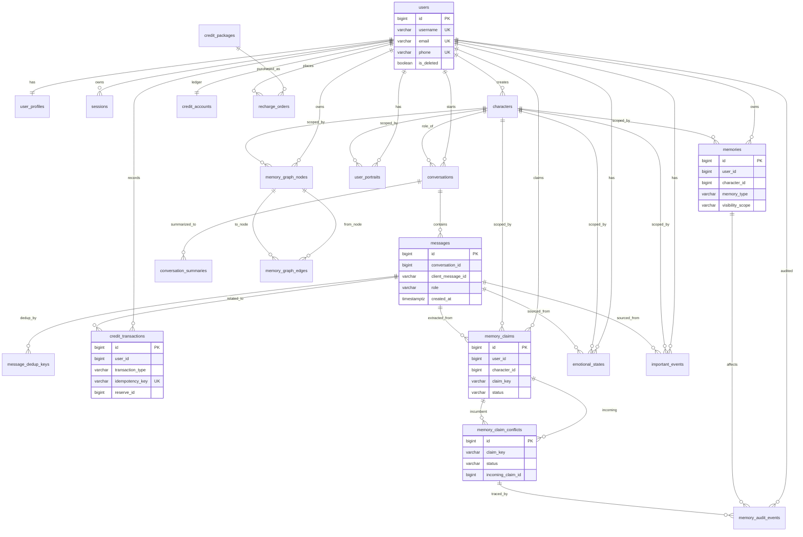

# Data Model: AI 情感伴侣平台

**Change ID**: `ai-companion-platform`  
**Version**: v1.0 (pre-dev baseline)  
**DB**: PostgreSQL 16 + pgvector  

---

## 1. 设计目标与边界

- 覆盖当前版本核心域：用户、角色、会话消息、计费账本、长期记忆。
- 支持 `billing-service` 账本 SoT 与 `conversation → memory` 异步写入链路。
- 保证实现阶段“零决策”：明确表、字段、索引、分区与迁移拆分。
- 与现有 OpenSpec 任务对齐：`T2.6.1 ~ T2.6.5`、`T2.4M.*`、`T2.5.6`。
- 记忆域补回 `specs/001-ai-companion-platform` 基线：关系时态边（`valid_from/valid_until`）、claim 冲突状态机、检索硬过滤门禁。

---

## 2. 全局约定

### 2.1 主键与时间字段

- 主键统一 `BIGINT`（Snowflake，由应用层生成）。
- 所有业务表至少包含 `created_at TIMESTAMPTZ NOT NULL DEFAULT now()`。
- 需要更新追踪的表包含 `updated_at TIMESTAMPTZ NOT NULL DEFAULT now()`。

### 2.2 关系策略

- 生产环境默认 **不依赖数据库外键强约束**（支持后续分库分表）。
- 通过应用层维护引用完整性；设计文档中仍标注逻辑关系用于审查与测试。

### 2.3 幂等与审计

- 消息幂等键：`client_message_id`（字符串）。
- 计费幂等键：`credit_transactions.idempotency_key`（唯一）。
- Claim 编排幂等键：`memory_claims.client_message_id + claim_key + user_id + character_id`。
- 当前范围内（`profile.*` 工具）关键安全事件进入 `memory_audit_events`。

### 2.4 分区策略

- `messages`：按 `created_at` 月分区（Range Partition）。
- `conversations`：按 `started_at` 月分区（已沿用现有迁移策略）。
- 业务查询约束：服务侧查询必须优先携带分区键（`messages.created_at` / `conversations.started_at`）；
  不将“仅按 id 全局扫描分区”作为标准查询路径。

### 2.5 检索安全门禁

- `visibility_filter` 与 `taboo_filter` 为 **硬过滤（Hard Gate）**，不参与打分与重排。
- 仅通过硬过滤的候选记忆才允许进入 re-rank 与 Prompt 注入阶段。
- 过滤拒绝事件需写入 `memory_audit_events`，用于审计与追责。

### 2.6 画像字段分级与 SoT 边界

- 画像字段按 Tier A/B/C 管理：
  - Tier A（关键单值）：`full_name`、`birth_date`、`current_occupation`
  - Tier B（多值共存）：`interests`、`skills`、`role_tags`
  - Tier C（推断弱信号）：人格倾向、偏好推断
- Tier A 新值一律先进入 `memory_claims`，未决议前不得覆盖 `user_portraits` canonical 值。
- 职业事实采用“当前投影 + 历史保留”：
  - 当前值：`user_portraits.current_occupation`
  - 历史值：`user_portraits.career_history`（或等价时态 claim 结构）
- Agent 侧工具调用必须经过 `mcp-service`（通用 MCP 网关）并路由到对应业务服务；
  画像写入场景必须由 `mcp-service` 调用 `memory-service` 执行持久化。
- `mcp-service` 不得直写业务数据库，不得成为第二个 SoT。

`user_profiles` 与 `user_portraits` 边界约定：
- `user_profiles`：账号资料 SoT（用户设置入口，可手动编辑）
- `user_portraits`：对话画像 SoT（Agent 检索与记忆注入）
- 不做双向自动覆盖；用户手动编辑按 `USER_STATED` 高优先级进入 claim 决议流
- 决议优先级：`USER_STATED > EXTRACTED > INFERRED`

### 2.7 认证安全存储约定（MVP）

- 登录失败锁定（5次/15分钟）由 Redis TTL 计数实现，不在 PostgreSQL 新增 `login_attempts` 表。
- Access token 仅经 `Authorization: Bearer` 传输，前端仅内存保存，不落地浏览器持久存储。
- Refresh token 使用 `HttpOnly + Secure + SameSite` Cookie 传输（Cookie Path 收敛到 `/api/v1/users/refresh`）；PostgreSQL 仅保存 `sessions.refresh_token_hash`。
- `sessions.id` 作为 access token `sid` claim 的绑定锚点，实现 JWT 与服务端会话关联。
- 登出“立即失效”通过 Redis 黑名单实现，不新增 PostgreSQL 黑名单表。
  - `auth:blacklist:sid:{sid}`：会话级封禁，TTL 至少覆盖该会话剩余生命周期
  - `auth:blacklist:jti:{jti}`：令牌级封禁，TTL 对齐 access token 剩余生命周期
- 黑名单校验默认采用 fail-closed：Redis 不可用时拒绝受保护请求，避免已撤销 token 被误放行。
- refresh/logout 接口采用 Cookie 鉴权时必须配套 CSRF 防护（Origin/Referer 校验与 CSRF token 机制）。
- 密码重置流程（token/邮件链路）延期到 v1.1，不阻塞当前 MVP 数据模型验收。

---

## 3. ER 图（Mermaid）



---

## 4. 表设计（DDL 草案）

> 说明：以下为实现级 DDL 草案；索引名可在迁移中按团队规范微调，但字段语义不可漂移。

### 4.1 用户域

```sql
CREATE TABLE users (
    id BIGINT PRIMARY KEY,
    username VARCHAR(50) UNIQUE NOT NULL,
    email VARCHAR(255) UNIQUE NOT NULL,
    password_hash VARCHAR(255) NOT NULL,
    phone VARCHAR(20) UNIQUE,
    avatar_url TEXT,
    email_verified BOOLEAN NOT NULL DEFAULT FALSE,
    last_login_at TIMESTAMPTZ,
    is_deleted BOOLEAN NOT NULL DEFAULT FALSE,
    deletion_scheduled_at TIMESTAMPTZ,
    created_at TIMESTAMPTZ NOT NULL DEFAULT now(),
    updated_at TIMESTAMPTZ NOT NULL DEFAULT now(),
    CONSTRAINT chk_users_username_len CHECK (char_length(username) >= 3)
);

CREATE INDEX idx_users_created_at ON users(created_at);
CREATE INDEX idx_users_deletion_scheduled_at ON users(deletion_scheduled_at)
WHERE deletion_scheduled_at IS NOT NULL;

CREATE TABLE user_profiles (
    user_id BIGINT PRIMARY KEY,
    full_name VARCHAR(100),
    gender VARCHAR(20),
    birth_date DATE,
    location JSONB,
    interests TEXT[],
    occupation VARCHAR(100),
    bio TEXT,
    created_at TIMESTAMPTZ NOT NULL DEFAULT now(),
    updated_at TIMESTAMPTZ NOT NULL DEFAULT now(),
    CONSTRAINT chk_user_profiles_gender CHECK (gender IS NULL OR gender IN ('male','female','other'))
);

-- user_profiles 仅承载账号侧“用户设置资料”SoT；
-- 对话画像 canonical 不在本表决议，走 memory_claims -> user_portraits 流程。

CREATE TABLE sessions (
    id BIGINT PRIMARY KEY,
    user_id BIGINT NOT NULL,
    refresh_token_hash VARCHAR(255) NOT NULL,
    device_id VARCHAR(64),
    user_agent TEXT,
    ip_address INET,
    expires_at TIMESTAMPTZ NOT NULL,
    revoked_at TIMESTAMPTZ,
    created_at TIMESTAMPTZ NOT NULL DEFAULT now(),
    updated_at TIMESTAMPTZ NOT NULL DEFAULT now()
);

CREATE INDEX idx_sessions_user_id ON sessions(user_id);
CREATE INDEX idx_sessions_expires_at ON sessions(expires_at);
CREATE INDEX idx_sessions_refresh_active ON sessions(refresh_token_hash)
WHERE revoked_at IS NULL;

-- sessions 为 refresh token 的服务端会话锚点：
-- 1) refresh token 明文不入库，仅保存 hash
-- 2) session.id 对应 access token 的 sid claim
-- 3) access token 立即失效依赖 Redis 黑名单（sid/jti），不额外新增 PG 表
```

### 4.2 角色与会话消息域

```sql
CREATE TABLE characters (
    id BIGINT PRIMARY KEY,
    user_id BIGINT,
    name VARCHAR(100) NOT NULL,
    avatar_url TEXT,
    description TEXT,
    personality JSONB NOT NULL DEFAULT '{}'::jsonb,
    background_story TEXT,
    speaking_style TEXT,
    system_prompt TEXT NOT NULL,
    world_view JSONB NOT NULL DEFAULT '{}'::jsonb,
    is_public BOOLEAN NOT NULL DEFAULT FALSE,
    is_preset BOOLEAN NOT NULL DEFAULT FALSE,
    version INT NOT NULL DEFAULT 1,
    is_deleted BOOLEAN NOT NULL DEFAULT FALSE,
    created_at TIMESTAMPTZ NOT NULL DEFAULT now(),
    updated_at TIMESTAMPTZ NOT NULL DEFAULT now(),
    CONSTRAINT chk_characters_name_len CHECK (char_length(name) >= 2)
);

CREATE INDEX idx_characters_user_id ON characters(user_id) WHERE NOT is_deleted;
CREATE INDEX idx_characters_public ON characters(is_public) WHERE is_public = TRUE AND NOT is_deleted;
CREATE INDEX idx_characters_preset ON characters(is_preset) WHERE is_preset = TRUE;

CREATE TABLE conversations (
    id BIGINT NOT NULL,
    user_id BIGINT NOT NULL,
    character_id BIGINT NOT NULL,
    title VARCHAR(255),
    message_count INT NOT NULL DEFAULT 0,
    token_count INT NOT NULL DEFAULT 0,
    started_at TIMESTAMPTZ NOT NULL DEFAULT now(),
    last_message_at TIMESTAMPTZ NOT NULL DEFAULT now(),
    is_archived BOOLEAN NOT NULL DEFAULT FALSE,
    created_at TIMESTAMPTZ NOT NULL DEFAULT now(),
    updated_at TIMESTAMPTZ NOT NULL DEFAULT now(),
    PRIMARY KEY (id, started_at)
) PARTITION BY RANGE (started_at);

CREATE INDEX idx_conversations_user_character ON conversations(user_id, character_id);
CREATE INDEX idx_conversations_last_message_at ON conversations(last_message_at DESC);
-- 查询约束：按会话 ID 查询时应携带 started_at（或先走会话索引映射），避免按 id 扫全分区。

CREATE TABLE messages (
    id BIGINT NOT NULL,
    conversation_id BIGINT NOT NULL,
    client_message_id VARCHAR(64) NOT NULL,
    role VARCHAR(20) NOT NULL,
    content TEXT NOT NULL,
    token_count INT NOT NULL DEFAULT 0,
    metadata JSONB,
    created_at TIMESTAMPTZ NOT NULL DEFAULT now(),
    updated_at TIMESTAMPTZ NOT NULL DEFAULT now(),
    PRIMARY KEY (id, created_at),
    CONSTRAINT chk_messages_role CHECK (role IN ('user','assistant','system'))
) PARTITION BY RANGE (created_at);

CREATE INDEX idx_messages_conversation_time ON messages(conversation_id, created_at DESC);
CREATE INDEX idx_messages_client_message_id ON messages(client_message_id);
-- 注意：messages 分区表不承载全局 UNIQUE(client_message_id)，全局幂等由 message_dedup_keys 统一保证
-- 查询约束：按 message id 查询时应携带 created_at（或先用 dedup/映射表定位分区）。

-- 全局幂等键映射（避免分区表上全局 unique 限制）
CREATE TABLE message_dedup_keys (
    client_message_id VARCHAR(64) PRIMARY KEY,
    user_id BIGINT NOT NULL,
    conversation_id BIGINT NOT NULL,
    message_id BIGINT NOT NULL,
    status VARCHAR(20) NOT NULL DEFAULT 'RESERVED',
    reserved_at TIMESTAMPTZ NOT NULL DEFAULT now(),
    finalized_at TIMESTAMPTZ,
    ttl_at TIMESTAMPTZ,
    metadata JSONB,
    CONSTRAINT chk_message_dedup_status CHECK (status IN ('RESERVED', 'FINALIZED', 'FAILED', 'EXPIRED'))
);

CREATE INDEX idx_message_dedup_ttl ON message_dedup_keys(ttl_at)
WHERE status IN ('FAILED', 'EXPIRED');

-- Outbox 可靠投递（conversation -> memory 异步事件）
CREATE TABLE outbox_events (
    id BIGINT PRIMARY KEY,
    aggregate_type VARCHAR(64) NOT NULL,      -- conversation/message
    aggregate_id BIGINT NOT NULL,             -- message_id
    event_type VARCHAR(128) NOT NULL,         -- evt.memory.write.requested
    payload JSONB NOT NULL,
    status VARCHAR(20) NOT NULL DEFAULT 'PENDING',
    retry_count INT NOT NULL DEFAULT 0,
    max_retries INT NOT NULL DEFAULT 16,
    next_retry_at TIMESTAMPTZ,
    published_at TIMESTAMPTZ,
    last_error TEXT,
    created_at TIMESTAMPTZ NOT NULL DEFAULT now(),
    updated_at TIMESTAMPTZ NOT NULL DEFAULT now(),
    CONSTRAINT chk_outbox_status CHECK (status IN ('PENDING', 'PUBLISHED', 'FAILED', 'DEAD'))
);

CREATE INDEX idx_outbox_pending ON outbox_events(status, next_retry_at, created_at);
CREATE INDEX idx_outbox_aggregate ON outbox_events(aggregate_type, aggregate_id);
```

### 4.3 计费域（billing-service SoT）

```sql
CREATE TABLE credit_accounts (
    user_id BIGINT PRIMARY KEY,
    balance BIGINT NOT NULL DEFAULT 0,
    reserved_balance BIGINT NOT NULL DEFAULT 0,
    total_recharged BIGINT NOT NULL DEFAULT 0,
    total_consumed BIGINT NOT NULL DEFAULT 0,
    version INT NOT NULL DEFAULT 0,
    created_at TIMESTAMPTZ NOT NULL DEFAULT now(),
    updated_at TIMESTAMPTZ NOT NULL DEFAULT now(),
    CONSTRAINT chk_credit_balance_non_negative CHECK (balance >= 0),
    CONSTRAINT chk_credit_reserved_non_negative CHECK (reserved_balance >= 0)
);

-- 并发语义：主扣费链路采用行锁事务 + 条件更新，version 仅用于管理端审计/人工调账并发控制。

CREATE TABLE credit_transactions (
    id BIGINT PRIMARY KEY,
    user_id BIGINT NOT NULL,
    transaction_type VARCHAR(20) NOT NULL,
    amount BIGINT NOT NULL,
    balance_after BIGINT NOT NULL,
    idempotency_key VARCHAR(255) NOT NULL UNIQUE,
    reference_type VARCHAR(32),
    reference_id VARCHAR(128),
    message_id BIGINT,
    reserve_id BIGINT,
    status VARCHAR(20) NOT NULL DEFAULT 'SUCCESS',
    metadata JSONB,
    created_at TIMESTAMPTZ NOT NULL DEFAULT now(),
    CONSTRAINT chk_credit_tx_type CHECK (transaction_type IN ('GRANT','RESERVE','SETTLE','RELEASE','RECHARGE','REFUND','ADJUST'))
);

CREATE INDEX idx_credit_tx_user_time ON credit_transactions(user_id, created_at DESC);
CREATE INDEX idx_credit_tx_reserve_id ON credit_transactions(reserve_id) WHERE reserve_id IS NOT NULL;

CREATE TABLE credit_packages (
    id BIGINT PRIMARY KEY,
    package_code VARCHAR(64) UNIQUE NOT NULL,
    name VARCHAR(100) NOT NULL,
    credits BIGINT NOT NULL,
    bonus_credits BIGINT NOT NULL DEFAULT 0,
    price_usd NUMERIC(10,2) NOT NULL,
    is_active BOOLEAN NOT NULL DEFAULT TRUE,
    sort_order INT NOT NULL DEFAULT 100,
    created_at TIMESTAMPTZ NOT NULL DEFAULT now(),
    updated_at TIMESTAMPTZ NOT NULL DEFAULT now(),
    CONSTRAINT chk_credit_packages_credits CHECK (credits > 0),
    CONSTRAINT chk_credit_packages_bonus CHECK (bonus_credits >= 0),
    CONSTRAINT chk_credit_packages_price CHECK (price_usd >= 0)
);

CREATE TABLE recharge_orders (
    id BIGINT PRIMARY KEY,
    order_no VARCHAR(64) UNIQUE NOT NULL,
    user_id BIGINT NOT NULL,
    package_id BIGINT,
    credits BIGINT NOT NULL,
    amount_usd NUMERIC(10,2) NOT NULL,
    payment_provider VARCHAR(32),
    payment_status VARCHAR(20) NOT NULL DEFAULT 'PENDING',
    idempotency_key VARCHAR(128) UNIQUE,
    paid_at TIMESTAMPTZ,
    metadata JSONB,
    created_at TIMESTAMPTZ NOT NULL DEFAULT now(),
    updated_at TIMESTAMPTZ NOT NULL DEFAULT now(),
    CONSTRAINT chk_recharge_orders_status CHECK (payment_status IN ('PENDING','PAID','FAILED','CANCELLED')),
    CONSTRAINT chk_recharge_orders_credits CHECK (credits > 0),
    CONSTRAINT chk_recharge_orders_amount CHECK (amount_usd >= 0)
);

CREATE INDEX idx_recharge_orders_user_time ON recharge_orders(user_id, created_at DESC);
CREATE INDEX idx_recharge_orders_status ON recharge_orders(payment_status, created_at DESC);
```

### 4.4 长期记忆域（memory-service）

```sql
CREATE TABLE memories (
    id BIGINT PRIMARY KEY,
    user_id BIGINT NOT NULL,
    character_id BIGINT NOT NULL,
    conversation_id BIGINT,
    source_message_id BIGINT,
    client_message_id VARCHAR(64),
    source_type VARCHAR(24) NOT NULL DEFAULT 'EXTRACTED',
    target_table VARCHAR(64),
    target_id BIGINT,
    memory_type VARCHAR(32) NOT NULL,
    content TEXT NOT NULL,
    embedding VECTOR(1536),
    importance_score NUMERIC(5,2) NOT NULL DEFAULT 50.00,
    decay_factor NUMERIC(5,2) NOT NULL DEFAULT 1.00,
    boost_count INT NOT NULL DEFAULT 0,
    access_count INT NOT NULL DEFAULT 0,
    visibility_scope VARCHAR(32) NOT NULL DEFAULT 'OWNER_PRIVATE',
    actor_user_id BIGINT,
    is_mutable BOOLEAN NOT NULL DEFAULT TRUE,
    last_accessed_at TIMESTAMPTZ,
    metadata JSONB,
    created_at TIMESTAMPTZ NOT NULL DEFAULT now(),
    updated_at TIMESTAMPTZ NOT NULL DEFAULT now(),
    is_deleted BOOLEAN NOT NULL DEFAULT FALSE,
    CONSTRAINT chk_memories_type CHECK (memory_type IN ('PROFILE','EMOTION','EVENT','SUMMARY','ENTITY','RELATION','CORE')),
    CONSTRAINT chk_memories_source_type CHECK (source_type IN ('EXTRACTED','INFERRED','USER_STATED')),
    CONSTRAINT chk_memories_visibility CHECK (visibility_scope IN ('OWNER_PRIVATE','PUBLIC','VISITOR_PRIVATE')),
    CONSTRAINT chk_memories_target_ref CHECK (
        (target_table IS NULL AND target_id IS NULL)
        OR (target_table IS NOT NULL AND target_id IS NOT NULL)
    )
);

CREATE INDEX idx_memories_user_character ON memories(user_id, character_id, created_at DESC)
WHERE NOT is_deleted;
CREATE INDEX idx_memories_visibility_priority ON memories(user_id, character_id, visibility_scope, importance_score DESC, updated_at DESC)
WHERE NOT is_deleted;
CREATE INDEX idx_memories_source_message ON memories(source_message_id)
WHERE source_message_id IS NOT NULL;
CREATE INDEX idx_memories_client_message ON memories(client_message_id)
WHERE client_message_id IS NOT NULL;
CREATE INDEX idx_memories_target_ref ON memories(target_table, target_id)
WHERE target_table IS NOT NULL AND target_id IS NOT NULL;
CREATE INDEX idx_memories_embedding_hnsw ON memories USING hnsw (embedding vector_cosine_ops)
WITH (m = 16, ef_construction = 64);

-- 记忆检索固定为三段式：Recall -> Hard Gate -> Re-rank
-- 注意：visibility/taboo 过滤为硬门禁，不参与评分

CREATE TABLE conversation_summaries (
    id BIGINT PRIMARY KEY,
    conversation_id BIGINT NOT NULL,
    user_id BIGINT NOT NULL,
    character_id BIGINT NOT NULL,
    start_message_id BIGINT,
    end_message_id BIGINT,
    summary TEXT NOT NULL,
    summary_tokens INT,
    compression_ratio NUMERIC(5,2),
    version INT NOT NULL DEFAULT 1,
    created_at TIMESTAMPTZ NOT NULL DEFAULT now(),
    updated_at TIMESTAMPTZ NOT NULL DEFAULT now()
);

CREATE INDEX idx_conversation_summaries_conv ON conversation_summaries(conversation_id, created_at DESC);

CREATE TABLE user_portraits (
    id BIGINT PRIMARY KEY,
    user_id BIGINT NOT NULL,
    character_id BIGINT NOT NULL,
    core_summary TEXT,
    demographics JSONB,
    preferences JSONB,
    persona_traits JSONB,
    current_occupation VARCHAR(100),
    career_history JSONB NOT NULL DEFAULT '[]'::jsonb,
    confidence_score NUMERIC(3,2) NOT NULL DEFAULT 0.50,
    source_memory_ids BIGINT[],
    version INT NOT NULL DEFAULT 1,
    created_at TIMESTAMPTZ NOT NULL DEFAULT now(),
    updated_at TIMESTAMPTZ NOT NULL DEFAULT now(),
    CONSTRAINT chk_user_portraits_demographics CHECK (
        demographics IS NULL OR jsonb_typeof(demographics) = 'object'
    ),
    CONSTRAINT chk_user_portraits_career_history CHECK (
        jsonb_typeof(career_history) = 'array'
    ),
    UNIQUE (user_id, character_id)
);

-- demographics 建议键：full_name / birth_date / gender / location
-- preferences 建议键：interests / skills / role_tags
-- current_occupation 表示当前职业投影；career_history 保留职业时态历史

CREATE TABLE memory_claims (
    id BIGINT PRIMARY KEY,
    user_id BIGINT NOT NULL,
    character_id BIGINT NOT NULL,
    source_message_id BIGINT,
    client_message_id VARCHAR(64),
    source_type VARCHAR(24) NOT NULL DEFAULT 'EXTRACTED',
    claim_key VARCHAR(128) NOT NULL,
    claim_value TEXT NOT NULL,
    claim_scope VARCHAR(32) NOT NULL DEFAULT 'PROFILE',
    field_tier VARCHAR(8) NOT NULL DEFAULT 'TIER_C',
    confidence_score NUMERIC(4,3) NOT NULL DEFAULT 0.500,
    rank_score NUMERIC(6,3) NOT NULL DEFAULT 0.500,
    status VARCHAR(20) NOT NULL DEFAULT 'PENDING',
    valid_from TIMESTAMPTZ,
    valid_until TIMESTAMPTZ,
    linked_memory_id BIGINT,
    metadata JSONB,
    created_at TIMESTAMPTZ NOT NULL DEFAULT now(),
    updated_at TIMESTAMPTZ NOT NULL DEFAULT now(),
    resolved_at TIMESTAMPTZ,
    CONSTRAINT chk_memory_claims_source_type CHECK (source_type IN ('EXTRACTED','INFERRED','USER_STATED')),
    CONSTRAINT chk_memory_claims_scope CHECK (claim_scope IN ('PROFILE','EVENT','RELATION','PREFERENCE')),
    CONSTRAINT chk_memory_claims_status CHECK (status IN ('PENDING','CONFLICTING','CLARIFYING','CONFIRMED','REJECTED','MERGED')),
    CONSTRAINT chk_memory_claims_field_tier CHECK (field_tier IN ('TIER_A','TIER_B','TIER_C')),
    CONSTRAINT chk_memory_claims_valid_window CHECK (valid_until IS NULL OR valid_from IS NULL OR valid_until > valid_from)
);

CREATE INDEX idx_memory_claims_user_char_key ON memory_claims(user_id, character_id, claim_key, created_at DESC);
CREATE INDEX idx_memory_claims_status ON memory_claims(status, updated_at DESC);
CREATE INDEX idx_memory_claims_tier_status ON memory_claims(field_tier, status, updated_at DESC);
CREATE INDEX idx_memory_claims_temporal ON memory_claims(user_id, character_id, claim_key, valid_until, valid_from DESC);
CREATE UNIQUE INDEX uq_memory_claims_dedup ON memory_claims(user_id, character_id, claim_key, client_message_id)
WHERE client_message_id IS NOT NULL;
CREATE INDEX idx_memory_claims_client_message ON memory_claims(client_message_id)
WHERE client_message_id IS NOT NULL;

-- claim_key 约定：
-- Tier A: profile.full_name / profile.birth_date / profile.current_occupation
-- Tier B: profile.interests.<normalized_value> / profile.skills.<normalized_value> / profile.role_tags.<normalized_value>
-- Tier C: inferred.persona.* / inferred.preference.*
-- Tier A 冲突进入 memory_claim_conflicts，决议前不得覆盖 user_portraits canonical 字段

CREATE TABLE memory_claim_conflicts (
    id BIGINT PRIMARY KEY,
    user_id BIGINT NOT NULL,
    character_id BIGINT NOT NULL,
    claim_key VARCHAR(128) NOT NULL,
    incumbent_claim_id BIGINT NOT NULL,
    incoming_claim_id BIGINT NOT NULL,
    conflict_type VARCHAR(32) NOT NULL DEFAULT 'VALUE_MISMATCH',
    status VARCHAR(32) NOT NULL DEFAULT 'OPEN',
    clarification_prompt TEXT,
    resolution_note TEXT,
    resolved_by_message_id BIGINT,
    resolved_at TIMESTAMPTZ,
    created_at TIMESTAMPTZ NOT NULL DEFAULT now(),
    updated_at TIMESTAMPTZ NOT NULL DEFAULT now(),
    CONSTRAINT chk_memory_claim_conflicts_type CHECK (conflict_type IN ('VALUE_MISMATCH','MUTEX_FIELD','AMBIGUOUS_APPEND')),
    CONSTRAINT chk_memory_claim_conflicts_status CHECK (status IN ('OPEN','CLARIFYING','RESOLVED_REPLACED','RESOLVED_APPENDED','RESOLVED_REJECTED','CANCELLED')),
    UNIQUE (incoming_claim_id)
);

CREATE INDEX idx_memory_claim_conflicts_user_time ON memory_claim_conflicts(user_id, character_id, created_at DESC);
CREATE INDEX idx_memory_claim_conflicts_status ON memory_claim_conflicts(status, updated_at DESC);

CREATE TABLE emotional_states (
    id BIGINT PRIMARY KEY,
    user_id BIGINT NOT NULL,
    character_id BIGINT NOT NULL,
    conversation_id BIGINT,
    message_id BIGINT,
    valence NUMERIC(4,3),
    arousal NUMERIC(4,3),
    dominance NUMERIC(4,3),
    primary_emotion VARCHAR(50),
    intensity NUMERIC(4,3),
    confidence_score NUMERIC(4,3) NOT NULL DEFAULT 0.500,
    metadata JSONB,
    recorded_at TIMESTAMPTZ NOT NULL DEFAULT now(),
    created_at TIMESTAMPTZ NOT NULL DEFAULT now(),
    CONSTRAINT chk_emotional_valence CHECK (valence IS NULL OR (valence >= -1 AND valence <= 1)),
    CONSTRAINT chk_emotional_arousal CHECK (arousal IS NULL OR (arousal >= 0 AND arousal <= 1)),
    CONSTRAINT chk_emotional_dominance CHECK (dominance IS NULL OR (dominance >= 0 AND dominance <= 1)),
    CONSTRAINT chk_emotional_primary_emotion CHECK (
        primary_emotion IS NULL OR primary_emotion IN ('JOY','TRUST','FEAR','SURPRISE','SADNESS','DISGUST','ANGER','ANTICIPATION','NEUTRAL')
    ),
    CONSTRAINT chk_emotional_signal_exists CHECK (primary_emotion IS NOT NULL OR valence IS NOT NULL)
);

CREATE INDEX idx_emotional_states_user_char_time ON emotional_states(user_id, character_id, recorded_at DESC);
CREATE INDEX idx_emotional_states_conv_time ON emotional_states(conversation_id, recorded_at DESC)
WHERE conversation_id IS NOT NULL;

CREATE TABLE important_events (
    id BIGINT PRIMARY KEY,
    user_id BIGINT NOT NULL,
    character_id BIGINT NOT NULL,
    message_id BIGINT,
    event_type VARCHAR(32),
    event_summary TEXT NOT NULL,
    temporal_context VARCHAR(255),
    importance NUMERIC(5,2) NOT NULL DEFAULT 50.00,
    occurred_at TIMESTAMPTZ NOT NULL,
    expiry_at TIMESTAMPTZ,
    status VARCHAR(16) NOT NULL DEFAULT 'ACTIVE',
    metadata JSONB,
    created_at TIMESTAMPTZ NOT NULL DEFAULT now(),
    updated_at TIMESTAMPTZ NOT NULL DEFAULT now(),
    CONSTRAINT chk_important_events_status CHECK (status IN ('ACTIVE','ARCHIVED','DELETED'))
);

CREATE INDEX idx_important_events_user_char_time ON important_events(user_id, character_id, occurred_at DESC);
CREATE INDEX idx_important_events_importance ON important_events(user_id, character_id, importance DESC);

CREATE TABLE memory_graph_nodes (
    id BIGINT PRIMARY KEY,
    user_id BIGINT NOT NULL,
    character_id BIGINT NOT NULL,
    node_type VARCHAR(32) NOT NULL,
    node_name VARCHAR(255) NOT NULL,
    normalized_name VARCHAR(255) NOT NULL,
    aliases TEXT[] NOT NULL DEFAULT '{}',
    node_properties JSONB,
    source_memory_id BIGINT,
    sync_status VARCHAR(16) NOT NULL DEFAULT 'PENDING',
    sync_version INT NOT NULL DEFAULT 0,
    last_synced_at TIMESTAMPTZ,
    created_at TIMESTAMPTZ NOT NULL DEFAULT now(),
    updated_at TIMESTAMPTZ NOT NULL DEFAULT now(),
    CONSTRAINT chk_memory_graph_nodes_sync CHECK (sync_status IN ('PENDING','SYNCED','FAILED')),
    UNIQUE (user_id, character_id, node_type, normalized_name)
);

CREATE INDEX idx_memory_graph_nodes_normalized_name ON memory_graph_nodes(user_id, character_id, normalized_name);
CREATE INDEX idx_memory_graph_nodes_aliases_gin ON memory_graph_nodes USING gin (aliases);
-- v1.0 图同步目标：Postgres 内部图投影（nodes/edges + sync_status），不强依赖外部图库。

CREATE TABLE memory_graph_edges (
    id BIGINT PRIMARY KEY,
    user_id BIGINT NOT NULL,
    character_id BIGINT NOT NULL,
    from_node_id BIGINT NOT NULL,
    to_node_id BIGINT NOT NULL,
    relation_type VARCHAR(64) NOT NULL,
    weight NUMERIC(5,2) NOT NULL DEFAULT 1.00,
    confidence NUMERIC(4,3) NOT NULL DEFAULT 0.500,
    valid_from TIMESTAMPTZ,
    valid_until TIMESTAMPTZ,
    source_memory_id BIGINT,
    sync_status VARCHAR(16) NOT NULL DEFAULT 'PENDING',
    sync_version INT NOT NULL DEFAULT 0,
    last_synced_at TIMESTAMPTZ,
    created_at TIMESTAMPTZ NOT NULL DEFAULT now(),
    updated_at TIMESTAMPTZ NOT NULL DEFAULT now(),
    CONSTRAINT chk_memory_graph_edges_sync CHECK (sync_status IN ('PENDING','SYNCED','FAILED')),
    CONSTRAINT chk_memory_graph_edges_confidence CHECK (confidence >= 0 AND confidence <= 1),
    CONSTRAINT chk_memory_graph_edges_valid_time CHECK (valid_until IS NULL OR valid_from IS NULL OR valid_until > valid_from),
    UNIQUE (user_id, character_id, from_node_id, to_node_id, relation_type, valid_from)
);

CREATE INDEX idx_memory_graph_edges_from ON memory_graph_edges(from_node_id);
CREATE INDEX idx_memory_graph_edges_to ON memory_graph_edges(to_node_id);
CREATE INDEX idx_memory_graph_edges_active ON memory_graph_edges(user_id, character_id, relation_type, valid_until);

CREATE TABLE memory_audit_events (
    id BIGINT PRIMARY KEY,
    user_id BIGINT NOT NULL,
    character_id BIGINT,
    memory_id BIGINT,
    event_type VARCHAR(64) NOT NULL,
    event_level VARCHAR(16) NOT NULL DEFAULT 'INFO',
    source_service VARCHAR(32) NOT NULL,
    request_id VARCHAR(64),
    payload JSONB,
    created_at TIMESTAMPTZ NOT NULL DEFAULT now(),
    CONSTRAINT chk_memory_audit_level CHECK (event_level IN ('INFO','WARN','ERROR')),
    CONSTRAINT chk_memory_audit_type CHECK (
        event_type IN (
            'ACCESS_DENIED',
            'CONFLICT_CLARIFICATION',
            'CONFLICT_STATE_TRANSITION',
            'CLAIM_PIPELINE_DLQ',
            'GRAPH_SYNC_FAILED',
            'MEMORY_EDIT',
            'MEMORY_DELETE'
        )
    )
);

CREATE INDEX idx_memory_audit_user_time ON memory_audit_events(user_id, created_at DESC);
CREATE INDEX idx_memory_audit_type_time ON memory_audit_events(event_type, created_at DESC);
```

### 4.5 配置域

```sql
CREATE TABLE system_configs (
    config_key VARCHAR(128) PRIMARY KEY,
    config_value JSONB NOT NULL,
    description TEXT,
    is_public BOOLEAN NOT NULL DEFAULT FALSE,
    updated_by BIGINT,
    created_at TIMESTAMPTZ NOT NULL DEFAULT now(),
    updated_at TIMESTAMPTZ NOT NULL DEFAULT now()
);

-- 示例 key：
-- billing.credit_formula
-- memory.compression.threshold
-- memory.decay.default_factor

-- v1.0 启动种子建议（由迁移脚本执行，幂等 upsert）：
-- INSERT INTO system_configs(config_key, config_value, description, is_public)
-- VALUES
-- ('billing.credit_formula', '{"usd_to_credit":100}'::jsonb, 'USD 到积分换算', false),
-- ('memory.compression.threshold', '{"token_threshold":6000}'::jsonb, '上下文压缩阈值', false),
-- ('memory.decay.default_factor', '{"daily_decay":0.98}'::jsonb, '默认遗忘衰减系数', false)
-- ON CONFLICT (config_key) DO UPDATE
-- SET config_value = EXCLUDED.config_value,
--     description = EXCLUDED.description,
--     updated_at = now();
```

---

## 5. 与任务/迁移映射

| 迁移 | 对应设计 | 备注 |
|------|----------|------|
| `000_init.sql` | 扩展与公共函数 | 包含 `uuid-ossp` 与通用 trigger function |
| `001_create_users.sql` | users / user_profiles / sessions / 账本基础 | 触发器使用幂等创建 |
| `002_create_characters.sql` | characters | 预设+用户自定义 |
| `004_create_conversations_table.sql` | conversations | 月分区 |
| `005_create_messages_table.sql` | messages | 月分区 |
| `006_seed_characters.sql` | 预设角色种子数据 | `ON CONFLICT` 幂等 |
| `007_billing_reserve_settle.sql` | credit_accounts/credit_transactions 扩展 | 预扣-结算-释放 |
| `008_messages_client_message_id.sql` | `message_dedup_keys` + `outbox_events` + messages 索引 | 全局幂等主路径 + 异步可靠投递 |
| `009_long_term_memory_core.sql` | 6 张长期记忆子表 + 关系时态字段 | Layer1~5 + `valid_from/valid_until` |
| `010_memory_extensions.sql` | memories / memory_claims / memory_claim_conflicts / memory_audit_events 扩展 | 优先级、可见性、冲突状态机、画像分级与职业时态、claim 幂等唯一约束、审计 |
| `011_system_configs_seed.sql` | system_configs 初始化 | 关键运行参数种子（billing/memory） |

---

## 6. 实施前检查清单

- [ ] 所有字段命名与 proto DTO 命名映射已确认（尤其 `client_message_id` / `message_id`）。
- [ ] `messages` 分区策略与幂等策略已确认（采用 `message_dedup_keys` 全局键表）。
- [ ] `conversations.message_count/token_count/last_message_at` 聚合字段维护逻辑已在会话写入事务内实现。
- [ ] `outbox_events` 与 relay worker 可靠投递语义已确认（事务内写入 + 异步重试投递）。
- [ ] `outbox_events.max_retries` 与全局重试策略已对齐（超过阈值标记 `DEAD`）。
- [ ] `credit_transactions.transaction_type` 枚举已与 billing RPC 行为对齐。
- [ ] `credit_accounts.version` 仅用于管理并发审计，主扣费链路采用行锁事务语义。
- [ ] `memory_audit_events` 事件类型与 `T2.4M.4a` 一致。
- [ ] `memories.actor_user_id` / `memories.access_count` 与 memory proto 字段对齐。
- [ ] `memories.visibility_scope` 约束已预留 `VISITOR_PRIVATE`（兼容后续社区化场景）。
- [ ] `memory_graph_edges.valid_from/valid_until` 与关系演化语义已在服务层实现（非覆盖写）。
- [ ] `memory_graph_nodes.normalized_name` / `aliases` 去重与消歧策略已在服务层落地。
- [ ] claim/conflict 双状态机已对齐：`memory_claims`（PENDING→CONFLICTING→CLARIFYING→CONFIRMED/REJECTED/MERGED）与 `memory_claim_conflicts`（OPEN→CLARIFYING→RESOLVED*）。
- [ ] `memory_claims.field_tier` 与 Tier A/B/C 规则映射已确认（含未知字段回退策略）。
- [ ] `user_portraits.current_occupation + career_history` 职业时态投影已与服务层实现对齐。
- [ ] `user_profiles`（账号资料 SoT）与 `user_portraits`（对话画像 SoT）边界已在服务层落地，且无双向自动覆盖。
- [ ] Agent 画像写路径仅经 `mcp-service -> memory-service`，无直写数据库旁路。
- [ ] 前端依赖接口字段（MemoryList/Update/Delete/Audit）已可从本模型直接映射。
- [ ] access token 传输策略已收敛为 `Authorization Header`，并确认未再依赖 query token。
- [ ] refresh token 仅通过 `HttpOnly + Secure + SameSite` Cookie 传输（Path 最小作用域为 `/api/v1/users/refresh`），服务端仅存 hash。
- [ ] Redis 黑名单键（`sid/jti`）TTL 策略已与 access/refresh 生命周期对齐（支持登出立即失效）。
- [ ] Redis 故障场景已明确 fail-closed 或受控降级回查策略（不可出现无保护放行）。
- [ ] Cookie 鉴权端点（refresh/logout/logout-all）已启用 CSRF 防护并通过集成测试。


---

## 7. Deferred Schema Backlog (v1.1+)

以下能力在当前 `v1.0` 明确延期，属于“有意不做”而非“设计遗漏”：

| 域 | 延期字段/能力 | 当前状态 | 目标版本 |
|----|---------------|----------|----------|
| memories | `memory_strength`、`last_boosted_at`、`boost_history`、`surprise_score`、`connectivity` | v1.0 采用 `importance_score + decay_factor + boost_count + access_count` 简化模型 | v1.2 |
| important_events | `title`、`is_recurring`、`participants`、`related_memory_ids`、`source_message_ids[]` | v1.0 保留 `event_summary + temporal_context + importance + status/expiry` | v1.2 |
| memory_graph_edges | `relation_description`、`mention_count`、`last_mentioned_at` | v1.0 保留 `confidence + valid_from/valid_until` 核心关系语义 | v1.2 |
| memory_graph_nodes | 节点向量 embedding 与高级热度统计 | v1.0 优先 `normalized_name + aliases` 去重与消歧 | v1.2 |
| emotional_states | `secondary_emotion`、`trigger_content/trigger_type` | v1.0 使用 `metadata` 承载扩展上下文，先保证主信号完整 | v1.2 |
| mcp 审计 | `mcp_audit_events`（跨域工具统一审计） | v1.0 由 profile 域复用 `memory_audit_events`，跨域工具审计后续独立建模 | v1.2 |

> 说明：延期项不计入当前变更的实现任务与验收 Gate，实施时以 `proposal.md` 与 `tasks.md` 的当前范围为准。
